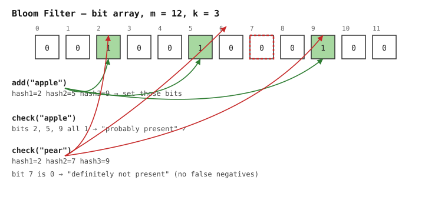
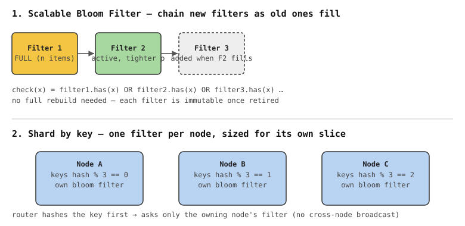
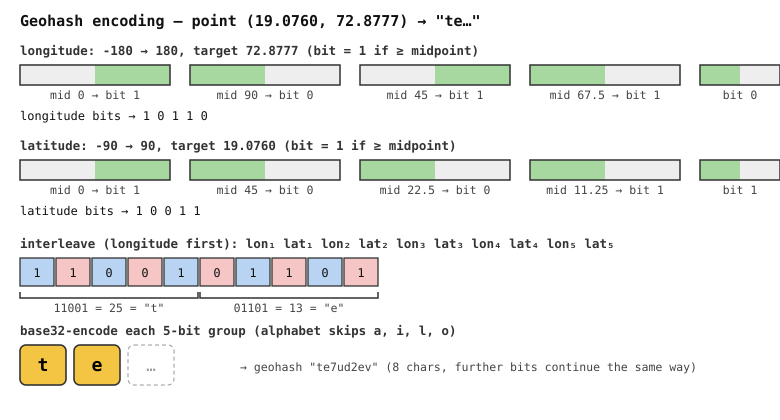
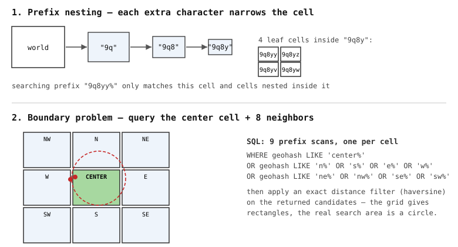
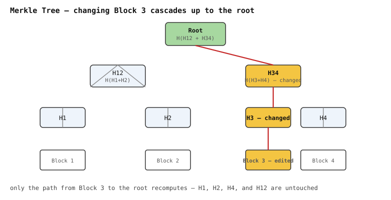
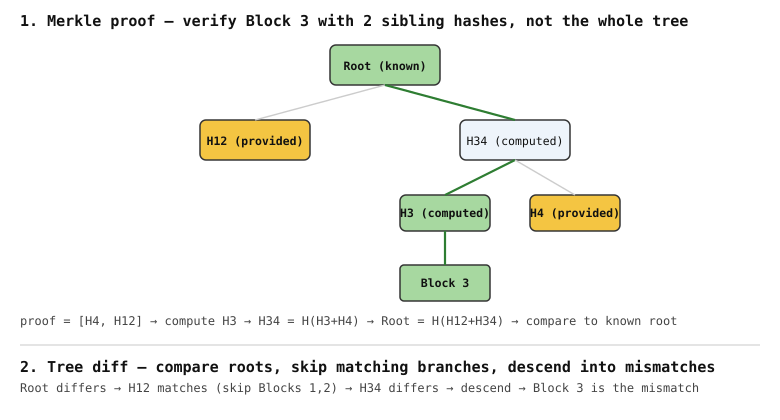

# Scalable Data Structures

Data structures that trade exactness or strict ordering for space/time efficiency at scale — used as cheap first checks or approximations in front of expensive operations.

# Bloom Filters

Bloom filters are compact filters that answer "definitely not present" or "probably present."

Used correctly, they have false positives but no false negatives for items that were added. Sizing matters: choose the expected item count and false-positive rate up front, then derive the bit-array size and number of hash functions.

## How it works

- A bit array of size `m`, all initialized to 0, plus `k` independent hash functions.
- **Add**: hash the item with all `k` functions, set the resulting `k` bit positions to 1.
- **Check**: hash the item with all `k` functions — if *any* of those bits is 0, the item was definitely never added; if all are 1, it's probably present (could be a false positive from bit overlap with other items).

```
add("apple")  → hash1=2, hash2=5, hash3=9  → set bits 2,5,9
check("apple")→ bits 2,5,9 all 1           → "probably present" ✓
check("pear") → hash1=2, hash2=7, hash3=9  → bit 7 is 0          → "definitely not present"
```



## Sizing

Pick `n` (expected item count) and `p` (acceptable false-positive rate) upfront, then derive:

```
m = -(n * ln(p)) / (ln 2)^2      # bits needed
k = (m / n) * ln(2)              # optimal number of hash functions
```

Undersizing `m` for the actual `n` inserted is the most common mistake — as the filter fills up, the false-positive rate climbs well past the target `p`.

## Simple Implementation (Python)

Only needs a bit array and hash functions. Instead of running `k` independent hash functions, this uses **double hashing** (Kirsch-Mitzenmacher) — derive `k` positions from just two hashes (`h1`, `h2`) via `h1 + i*h2`, which is cheaper and works just as well in practice.

⚠️ **Never hash with a language's default/built-in hash function** (Python's `hash()`, etc.) if the filter is saved to disk, shared between services, or reused after a restart. `hash()` on `str`/`bytes` is randomized per-process (`PYTHONHASHSEED`) as a DoS mitigation — the same item hashes to different bit positions in a different process, so loading a persisted filter elsewhere silently corrupts lookups (including false negatives, which breaks the core guarantee). Use a fixed, deterministic hash — `hashlib` here, or MurmurHash/xxHash in production — so the same item always maps to the same bits everywhere.

```python
import math
import hashlib


class BloomFilter:
    def __init__(self, n: int, p: float):
        """n = expected item count, p = target false-positive rate."""
        self.m = self._bit_array_size(n, p)
        self.k = self._hash_count(self.m, n)
        self.bits = bytearray(math.ceil(self.m / 8))  # m bits, packed into bytes

    @staticmethod
    def _bit_array_size(n: int, p: float) -> int:
        return math.ceil(-(n * math.log(p)) / (math.log(2) ** 2))

    @staticmethod
    def _hash_count(m: int, n: int) -> int:
        return max(1, round((m / n) * math.log(2)))

    def _hashes(self, item: str) -> list[int]:
        """Derive k bit positions from two base hashes (double hashing)."""
        h1 = int(hashlib.md5(item.encode()).hexdigest(), 16)
        h2 = int(hashlib.sha1(item.encode()).hexdigest(), 16)
        return [(h1 + i * h2) % self.m for i in range(self.k)]

    def _set_bit(self, pos: int) -> None:
        self.bits[pos // 8] |= 1 << (pos % 8)

    def _get_bit(self, pos: int) -> bool:
        return bool(self.bits[pos // 8] & (1 << (pos % 8)))

    def add(self, item: str) -> None:
        for pos in self._hashes(item):
            self._set_bit(pos)

    def check(self, item: str) -> bool:
        """False -> definitely not present. True -> probably present."""
        return all(self._get_bit(pos) for pos in self._hashes(item))


# ── Usage ────────────────────────────────────────────────────
bf = BloomFilter(n=1000, p=0.01)

bf.add("apple")
bf.add("banana")

print(bf.check("apple"))   # True  — probably present
print(bf.check("pear"))    # False — definitely not present
print(bf.m, bf.k)          # e.g. 9586 bits, 7 hash functions
```

Not production-grade (`md5`/`sha1` are slower than purpose-built hashes like MurmurHash, and there's no serialization), but it shows the mechanics end to end. For real use, reach for a library — `pybloom-live` (Python), Guava's `BloomFilter` (Java), or RedisBloom (`BF.ADD`/`BF.EXISTS`).

## Pros

- O(k) constant-time add/lookup, independent of item count.
- Very space-efficient — stores bits, not the actual keys.
- No false negatives — safe to skip an expensive lookup whenever the filter says "not present."

## Cons

- False positives are inherent — must size for an acceptable rate.
- No deletion in the standard version — clearing a bit can silently break membership for other items that hash to it.
- Can't enumerate or retrieve items — membership test only.
- Not suitable where exact answers matter (legal, security, financial decisions).

## Where it's used

- **Databases** — LSM-tree engines (RocksDB, Cassandra, HBase) keep a bloom filter per SSTable to skip disk reads for keys that don't exist.
- **Caches** — check the filter before hitting cache/DB to avoid cache penetration from repeated lookups of nonexistent keys.
- **Crawlers** — dedupe visited URLs without storing the full URL set.
- **Distributed systems** — reduce cross-node calls, e.g., a node checks its bloom filter before asking a peer "do you have this key?"

## Real-world examples

| Application                       | How it uses a Bloom filter                                                                                                          |
| ---------------------------------- | ------------------------------------------------------------------------------------------------------------------------------------ |
| **Google Chrome** (Safe Browsing) | Downloads a local bloom filter of known-malicious URL hashes — checks it before every page load, only calls Google's API on a hit, so most safe browsing never leaves the device. |
| **Apache Cassandra**              | Each SSTable has a bloom filter of its row keys — skips a disk read entirely if the filter says the key isn't in that SSTable.       |
| **Apache HBase**                  | Same idea per `StoreFile` — avoids opening files that can't contain the requested row/column.                                       |
| **RocksDB / LevelDB**             | Per-SST-file filter block, checked before a disk seek — the backbone of the "skip the read" pattern used above by Cassandra/HBase.  |
| **Bitcoin (BIP 37, SPV wallets)** | Lightweight wallets send a bloom filter of their addresses to a full node, which replies only with matching transactions — filters out irrelevant blocks without the wallet revealing exact addresses. |
| **Ethereum**                      | Every block header carries a bloom filter over event-log topics — light clients check it to decide if a block is even worth downloading for logs matching a query. |
| **Akamai CDN**                    | Uses a bloom filter to detect "one-hit-wonders" (objects requested only once) so they're not cached, avoiding cache pollution.       |
| **Medium**                        | Used a bloom filter to avoid re-recommending articles a user has already read/seen, without storing full read-history per user.     |
| **Squid proxy**                   | Cache digests (bloom-filter-based summaries) let proxies ask peers "do you have this object?" without a full protocol round trip.    |
| **Redis (RedisBloom module)**     | Ships probabilistic data structures — `BF.ADD` / `BF.EXISTS` — as a first-class Redis command, for app-level use without hand-rolling one. |
| **PostgreSQL (`bloom` extension)**| A contrib index type using a bloom filter per row for fast equality checks across many columns at once, when no single column is selective enough for a B-tree. |

## Scaling it

A single fixed-size filter degrades as item count grows past its sized `n` — fill ratio rises and so does the false-positive rate. Options:

- **Scalable Bloom Filter** — chain multiple filters; when one fills up, add a new one (typically with a tighter `p`), and check membership across the whole chain (OR across filters). Avoids a full rebuild.
- **Counting Bloom Filter** — replace each bit with a small counter (e.g., 4 bits) so deletion becomes decrementing instead of clearing a shared bit. Costs more memory for the ability to delete.
- **Shard by key** — in distributed systems, give each shard/node its own filter sized for its slice of the keyspace, rather than one giant shared filter.
- **Periodic rebuild** — once actual `n` outgrows the original estimate by a wide margin, recompute `m`/`k` and re-insert all known items rather than letting `p` silently drift.



**Default advice:** size generously for expected growth up front — resizing/rebuilding a bloom filter isn't a cheap in-place operation like resizing a hash table, since bit positions depend on `m`.

# GeoHash

Location systems keep needing to answer one question fast: *what's near this point?* Scanning every lat/lng row and computing distance one by one doesn't work once there are millions of restaurants, drivers, or devices.

Geohash turns a location into a short string, where nearby places usually share a prefix. That lets an ordinary ordered index (a B-tree) fetch a small set of candidates before doing any real distance math.

Geohash is not an exact distance calculator — it's a first-pass filter. Real systems still check neighboring cells, compute actual distance, and pick precision deliberately.

## How it works

Three steps: repeatedly halve the longitude and latitude ranges, interleave the resulting bits (longitude first), then base32-encode every 5 bits.

**Splitting the range** — at each step, ask "is the target in the lower or upper half of the current range?" `0` for lower, `1` for upper, then recurse into that half.

Encoding `(19.0760, 72.8777)` — Mumbai:

| # | Longitude range | Mid | Value vs mid | Bit |
|---|---|---|---|---|
| 1 | [-180, 180] | 0 | ≥ | 1 |
| 2 | [0, 180] | 90 | < | 0 |
| 3 | [0, 90] | 45 | ≥ | 1 |
| 4 | [45, 90] | 67.5 | ≥ | 1 |
| 5 | [67.5, 90] | 78.75 | < | 0 |

| # | Latitude range | Mid | Value vs mid | Bit |
|---|---|---|---|---|
| 1 | [-90, 90] | 0 | ≥ | 1 |
| 2 | [0, 90] | 45 | < | 0 |
| 3 | [0, 45] | 22.5 | < | 0 |
| 4 | [0, 22.5] | 11.25 | ≥ | 1 |
| 5 | [11.25, 22.5] | 16.875 | ≥ | 1 |

**Interleave** (longitude bit, latitude bit, repeat): `1 1 0 0 1 0 1 1 0 1` → grouped into 5-bit chunks → `11001` (=25) and `01101` (=13).

**Base32-encode** each chunk with the geohash alphabet `0123456789bcdefghjkmnpqrstuvwxyz` (`a`, `i`, `l`, `o` skipped to avoid misreads) → index 25 = `t`, index 13 = `e` → geohash starts `"te…"`, and continues to `"te7ud2ev"` at 8 characters.



Same input always produces the same string — that's what makes a geohash usable as a plain, sortable index key.

Points sharing a prefix are in the same rectangular cell; longer shared prefixes mean closer points. But the reverse isn't guaranteed — two nearby points can fall on opposite sides of a cell boundary and get completely different prefixes (see the boundary problem below).

## Precision

Precision is just string length — each extra character adds 5 bits, so the cell shrinks fast. Approximate cell size **near the equator**:

| Length | Cell width | Cell height | Typical use |
|---|---|---|---|
| 4 | 39.1 km | 19.5 km | City-level grouping |
| 5 | 4.9 km | 4.9 km | Neighborhood search |
| 6 | 1.2 km | 0.61 km | Nearby candidates |
| 7 | 153 m | 153 m | Block-level candidates |
| 8 | 38 m | 19 m | Building-level candidates |
| 9 | 4.8 m | 4.8 m | Fine outdoor positioning |

Cell height stays fairly constant; cell **width shrinks toward the poles** because longitude lines converge — a 6-char cell in San Francisco (~38°N) is narrower east-west than the same cell at the equator.

Rule of thumb: 5 chars for broad discovery ("restaurants nearby"), 6–7 for nearby drivers/couriers/stores, 8+ only when GPS accuracy and data density justify it. Don't guess — measure candidate counts in dense areas (Manhattan) and sparse ones (rural) separately; they behave very differently at the same precision.

## Nearby search

1. Convert the query point to a geohash at the chosen precision.
2. Fetch candidates via a prefix query (`LIKE '9q8yy%'`, or the equivalent range scan `WHERE geohash >= '9q8yy' AND geohash < '9q8yz'`).
3. **Also query the 8 neighboring cells** — a point 10m from the query center can sit just across a cell boundary and get skipped by a single-prefix query. This is the most common geohash bug: works in a demo, silently drops edge results in production.
4. Apply an exact distance filter (haversine) on the combined candidate set — the grid gives rectangles, the real search area is a circle, so corners bring in extra false candidates that must be filtered out.
5. Rank and page (ETA, availability, price, relevance — business logic, not geohash's job).



## Simple Implementation (Python)

```python
import math

BASE32 = "0123456789bcdefghjkmnpqrstuvwxyz"
BASE32_INDEX = {c: i for i, c in enumerate(BASE32)}


def encode(lat: float, lon: float, precision: int = 8) -> str:
    lat_range, lon_range = [-90.0, 90.0], [-180.0, 180.0]
    geohash, bit, ch, even = [], 0, 0, True  # longitude bit goes first

    while len(geohash) < precision:
        rng = lon_range if even else lat_range
        val = lon if even else lat
        mid = (rng[0] + rng[1]) / 2
        if val >= mid:
            ch, rng[0] = (ch << 1) | 1, mid
        else:
            ch, rng[1] = ch << 1, mid
        even, bit = not even, bit + 1
        if bit == 5:
            geohash.append(BASE32[ch])
            bit = ch = 0

    return "".join(geohash)


def decode(geohash: str) -> tuple[float, float, float, float]:
    """Returns (lat, lon, lat_error, lon_error) — error is the half-height/width of the cell."""
    lat_range, lon_range, even = [-90.0, 90.0], [-180.0, 180.0], True

    for char in geohash:
        for shift in (4, 3, 2, 1, 0):
            bit = (BASE32_INDEX[char] >> shift) & 1
            rng = lon_range if even else lat_range
            mid = (rng[0] + rng[1]) / 2
            rng[0 if bit else 1] = mid
            even = not even

    lat = (lat_range[0] + lat_range[1]) / 2
    lon = (lon_range[0] + lon_range[1]) / 2
    return lat, lon, (lat_range[1] - lat_range[0]) / 2, (lon_range[1] - lon_range[0]) / 2


def neighbors(geohash: str) -> dict[str, str]:
    """Approximate the 8 surrounding cells by nudging one cell-width/height in each direction."""
    lat, lon, lat_err, lon_err = decode(geohash)
    deltas = {"n": (1, 0), "s": (-1, 0), "e": (0, 1), "w": (0, -1),
              "ne": (1, 1), "nw": (1, -1), "se": (-1, 1), "sw": (-1, -1)}
    return {
        name: encode(lat + dlat * 2 * lat_err, lon + dlon * 2 * lon_err, len(geohash))
        for name, (dlat, dlon) in deltas.items()
    }


def haversine_km(lat1, lon1, lat2, lon2) -> float:
    r = 6371.0
    p1, p2 = math.radians(lat1), math.radians(lat2)
    dphi, dlmb = math.radians(lat2 - lat1), math.radians(lon2 - lon1)
    a = math.sin(dphi / 2) ** 2 + math.cos(p1) * math.cos(p2) * math.sin(dlmb / 2) ** 2
    return 2 * r * math.asin(math.sqrt(a))


# ── Usage ────────────────────────────────────────────────────
gh = encode(19.0760, 72.8777, precision=8)
print(gh)                              # te7ud2ev
print(decode(gh))                      # (19.0759..., 72.8776..., ~8.6e-05, ~1.7e-04)
print(neighbors(gh))                   # {'n': 'te7ud2ey', 's': 'te7ud2eu', ...}
print(haversine_km(19.0760, 72.8777, *decode(gh)[:2]))  # ~0.008 km round-trip error
```

Verified: `encode(19.0760, 72.8777, 2)` → `"te"`, matching the hand trace above, and `decode("ezs42")` reproduces the well-known geohash.org example (~42.605, -5.603).

Not production-grade — no Date Line/pole handling, and the neighbor function approximates via re-encoding rather than direct bit manipulation. For real use: `python-geohash`, `pygeohash`, or a database's native geo type.

## Pros

- Plain string — sorts, indexes (B-tree), and stores in any normal column, no special database feature required.
- Prefix search doubles as coarse-to-fine spatial search: shorter prefix = wider area, longer = narrower.
- Cheap to compute and compare — good as a sharding or cache key, not just a query filter.

## Cons

- **Boundary problem** — nearby points can land in different cells (and totally different prefixes) if they straddle a cell edge. Always the top source of "missing nearby results" bugs.
- **Rectangular cells, not circles** — a radius search over a grid always pulls in extra corner candidates that need filtering.
- **Uneven cell size** — longitude degrees shrink toward the poles, so the same precision means a narrower cell at higher latitudes.
- **Date Line / poles** — points at ±180° longitude are physically adjacent but can have very different prefixes; very high latitudes behave poorly since longitude lines converge.
- Not a distance function — always needs a second, exact pass (haversine or the DB's distance function) before showing results to a user.

## Where it's used

| Application | How it uses Geohash |
|---|---|
| **Redis** (`GEOADD`/`GEOSEARCH`) | Stores each member in a sorted set using a 52-bit interleaved geohash-style score — geo commands are a thin layer over that ordering. |
| **Elasticsearch** | `geohash_grid` aggregation buckets documents by geohash prefix for map heatmaps and tile rendering. |
| **MongoDB** (legacy `2d` index) | Pre-`2dsphere` index type built on a geohash-like space-filling curve; `2dsphere` has since replaced it for most new code. |
| **Firebase / GeoFire** | Stores a geohash string alongside lat/lng in Firestore/Realtime DB so "nearby" queries can run as plain range queries — no native geo index needed. |
| **Uber** (early marketplace) | Used geohash-based cells for driver/rider matching and surge pricing regions before moving to H3 for better neighbor uniformity. |
| **BigQuery / Snowflake** | Expose a `ST_GEOHASH`/`GEOHASH` SQL function for bucketing rows into cells directly in analytics queries. |

## Scaling it

- **Store raw coordinates separately** — the geohash is an index key, not the source of truth. Keep `lat`/`lon` columns for exact distance checks, map display, and rebuilding the geohash if precision changes.
- **Combine with business filters** — real queries filter by status, category, or tenant too (`WHERE geohash LIKE '9q8yy%' AND status = 'open'`). Index/partition to match the actual query shape, not location alone.
- **Moving objects need a different store** — don't update a relational row on every GPS ping. Put live location (drivers, couriers, devices) in Redis/DynamoDB/Cassandra with TTLs or heartbeats, and keep it separate from historical location events.
- **Hot cells** — a busy downtown cell can dwarf the read/write volume of many rural cells combined. Shard by region-plus-load, cache heavy cells, and keep live-location writes off the slow path.
- **Reach for a native geo index first** — PostGIS (GiST/SP-GiST), MongoDB `2dsphere`, Elasticsearch `geo_point`/`geo_shape`, or Redis `GEO*` all handle the boundary/pole/Date-Line edge cases properly. Geohash is still worth it as a simple sharding/cache key even when a real spatial index handles the actual queries.
- **H3 (hexagonal) or S2 (spherical)** are the usual next step when neighbor uniformity, polygon covering, or global edge cases (Date Line, poles) start to matter more than a simple string key.

# Merkle Trees

To check whether a large file or dataset arrived correctly, you could compare one checksum for the whole thing. That works when it matches — but when it doesn't, all it tells you is "something changed." It doesn't say *what*, so the system may have to re-fetch or re-compare everything.

A Merkle tree fixes that by hashing data in chunks: hash each block, hash those hashes in pairs, keep going until one root hash remains. The root tells you if anything changed at all; the tree beneath it tells you exactly which block.

## How it works

- **Leaves** — hash of each individual data block.
- **Parents** — hash of the concatenation of their two children's hashes.
- **Root** — one hash that commits to the entire dataset.
- **Odd number of blocks** — duplicate the last hash so it has a pairing partner; keeps the tree shape simple.

```
Root = H(H12 + H34)
H12  = H(H1 + H2)          H34  = H(H3 + H4)
H1 = H(Block1)  H2 = H(Block2)   H3 = H(Block3)  H4 = H(Block4)
```

Change Block 3, and only the hashes on its path to the root recompute — `H3 → H34 → Root`. `H1`, `H2`, and `H12` are untouched, because they never depended on Block 3.



## Two things it enables

**Merkle proof — verify one block cheaply.** To prove Block 3 is correct against a trusted root, you don't need the whole tree — just the sibling hashes along its path (here, `H4` and `H12`): recompute `H3 = H(Block3)`, then `H34 = H(H3+H4)`, then `Root = H(H12+H34)`, and compare to the trusted root. `log₂(n)` hashes instead of `n`.

**Tree diff — find what differs between two copies.** Two nodes holding the same data range compare root hashes first. Match → done, no further work. Differ → compare children; whichever child hash matches gets skipped entirely, whichever differs gets walked into recursively — repeat until you land on the actual mismatched block(s). Finding one bad block among ~1M takes ~20 comparisons, not a million.



## Simple Implementation (Python)

```python
import hashlib


class MerkleTree:
    def __init__(self, data_blocks):
        self.leaves = [self._hash(block) for block in data_blocks]
        self.tree = self._build_tree(self.leaves)

    def _hash(self, data):
        if isinstance(data, str):
            data = data.encode()
        return hashlib.sha256(data).hexdigest()

    def _build_tree(self, leaves):
        if not leaves:
            return []
        tree = [leaves]
        current_level = leaves
        while len(current_level) > 1:
            next_level = []
            for i in range(0, len(current_level), 2):
                left = current_level[i]
                right = current_level[i + 1] if i + 1 < len(current_level) else left  # duplicate odd tail
                next_level.append(self._hash(left + right))
            tree.append(next_level)
            current_level = next_level
        return tree

    def get_root(self):
        return self.tree[-1][0] if self.tree else None

    def get_proof(self, index):
        """Sibling hashes needed to verify the leaf at `index`."""
        if index >= len(self.leaves):
            raise IndexError("Index out of range")
        proof = []
        current_index = index
        for level in self.tree[:-1]:  # exclude root level
            if current_index % 2 == 0:
                sibling_index, direction = current_index + 1, "right"
            else:
                sibling_index, direction = current_index - 1, "left"
            sibling_hash = level[sibling_index] if sibling_index < len(level) else level[current_index]
            proof.append((direction, sibling_hash))
            current_index //= 2
        return proof

    def verify_proof(self, data, proof, root):
        current_hash = self._hash(data)
        for direction, sibling_hash in proof:
            current_hash = self._hash(sibling_hash + current_hash) if direction == "left" \
                else self._hash(current_hash + sibling_hash)
        return current_hash == root


# ── Usage ────────────────────────────────────────────────────
transactions = ["tx1: Alice->Bob $50", "tx2: Bob->Carol $30", "tx3: Carol->Dave $20", "tx4: Dave->Eve $10"]
tree = MerkleTree(transactions)
root = tree.get_root()

proof = tree.get_proof(2)                                  # only 2 sibling hashes for 4 leaves
print(tree.verify_proof(transactions[2], proof, root))     # True
print(tree.verify_proof("tx3: Carol->Dave $999", proof, root))  # False — tampered data fails
```

Verified against the odd-leaf case too (5 blocks → last one duplicated) — every leaf's proof still round-trips correctly.

## Pros

- Verify one item in O(log n) instead of O(n) — a small proof, not the whole dataset.
- Detect *and* localize changes — a plain checksum only tells you "different," a Merkle tree tells you "block 3 is different."
- Comparing two trees skips every matching branch — sync work is proportional to what actually changed, not total data size.

## Cons

- Doesn't prevent tampering by itself — it only detects it, and only if you already have a trusted root from somewhere else (out-of-band, or signed).
- **Second-preimage / node-confusion attack** on naive implementations: if a leaf hash `H(block)` and an internal-node hash `H(left+right)` live in the same hash space, an attacker can craft a leaf whose content equals some `left+right` pair and pass it off as an internal node (or vice versa), forging a valid-looking proof for data that was never in the tree. The standard fix (RFC 6962 / Certificate Transparency) is **domain separation** — prefix leaf hashes with `0x00` and internal-node hashes with `0x01` before hashing, so the two can never collide. The reference implementation above skips this for clarity — don't skip it in anything real.
- Tree must be rebuilt (or incrementally updated) whenever blocks change — costly for highly mutable data. Append-only logs solve this with a **Merkle Mountain Range** (a forest of perfect binary trees instead of one, so appending is O(log n) instead of a full rebuild) — this is what Certificate Transparency and some blockchains actually use under the hood.
- Not a membership/lookup structure like a Bloom filter — it verifies data you already have a block index for, it doesn't answer "is X in this set" cheaply on its own.

## Where it's used

| Application | How it uses a Merkle tree |
|---|---|
| **Git** | Commit hashes depend on a tree of file/directory hashes plus the parent commit hash — changing any historical file changes every hash after it, which is how Git detects corruption or history tampering. |
| **Bitcoin** | Each block header stores the Merkle root of its transaction list — light (SPV) clients verify a transaction is in a block via a small proof, without downloading every transaction. |
| **Ethereum** | Goes further with a **Merkle Patricia Trie** — a Merkle tree merged with a prefix trie — for state, storage, and receipts. This is a common interview gotcha: it's not the same plain binary tree Bitcoin uses for its tx list; the trie structure also gives efficient key-based lookups and proofs-of-absence, not just proofs-of-inclusion. |
| **Cassandra / DynamoDB-style stores** | Each replica builds a Merkle tree over its data range; nodes exchange roots and walk down only the mismatched branches to repair drift (anti-entropy / read repair). |
| **Certificate Transparency logs** | Append-only Merkle tree (Merkle Mountain Range) of issued TLS certificates — lets auditors verify a certificate was logged and catch mis-issued ones without trusting the log operator blindly. |
| **IPFS / content-addressed storage** | Files are chunked and hashed into a Merkle DAG — identical chunks across different files are naturally deduplicated and independently verifiable. |

## Merkle tree vs. hash list vs. Bloom filter

| | Hash list | Merkle tree | Bloom filter |
|---|---|---|---|
| Verify one item | O(n) | O(log n) | O(k) |
| Detect changed data | Yes | Yes | No |
| Find *what* changed | O(n) | O(log n) | N/A |
| Space | O(n) | O(n) | O(m), sub-linear |
| Best for | simple whole-file checks | data sync, proofs, tamper detection | fast membership checks |

Reach for a Merkle tree when you need both "did anything change?" and "which part?" — a checksum alone only answers the first, a Bloom filter answers neither (it answers "have I seen this item," a different question).
