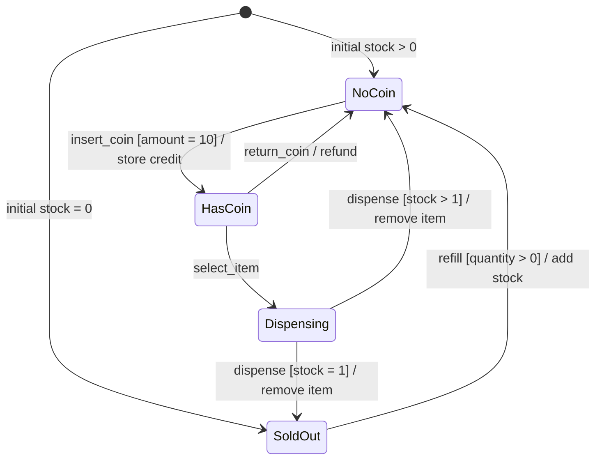
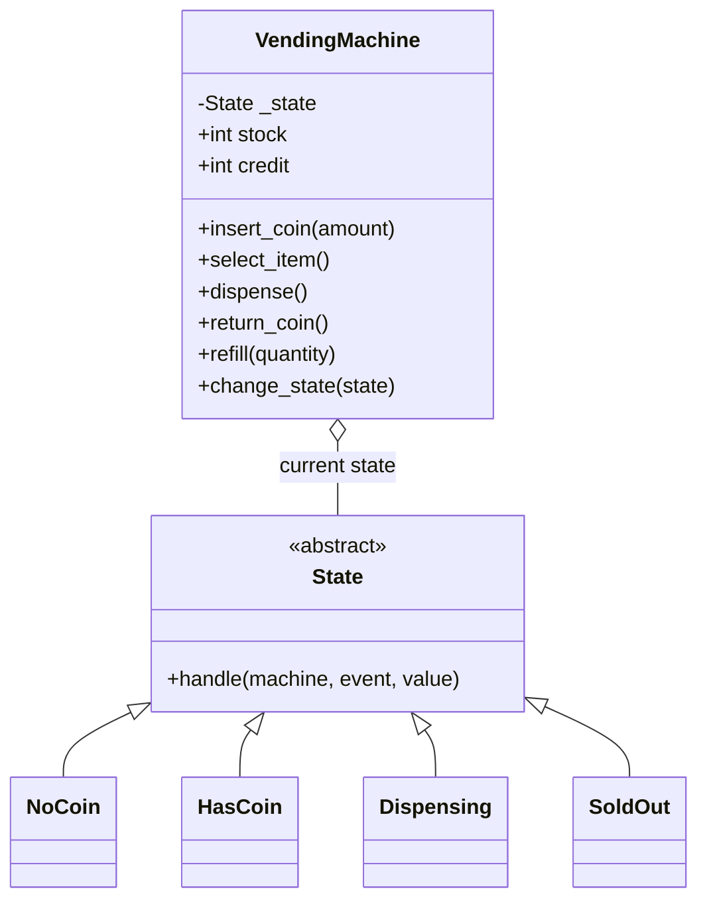

# State machines & the State design pattern — Python

· [OOP fundamentals](../oops-fundamentals.md) · [Practice](../practice-problems.md)

**Core idea:** the same operation can be valid, invalid, or behave differently depending on the object's current state.

```text
current state + event + guard → action + next state
```

| Term | Meaning | Vending example |
|---|---|---|
| State | Current mode; determines allowed behavior | `HasCoin` |
| Event | Something the machine receives | `select_item` |
| Guard | Condition required before accepting a transition | `stock > 0` |
| Action | Work performed on an accepted transition | Decrement stock |
| Context | Object holding current state and shared data | Machine, stock, credit |

There are **two ways we'll use to build state-based behavior**:

1. **Classic State pattern:** context → interface → concrete state. Each state class decides how to handle an operation.
2. **Table-driven state machine:** a table decides the next state from the current state and an event. Separate functions or classes can do the actual work.

Both model states and transitions. Strictly speaking, the first is the classic State design pattern; the second is another way to implement a state machine. We'll compare their use cases and practical boundaries in section 3.

## 1. Classic State pattern: context → interface → concrete state

### Start with rules, not classes

**Problem:** accept a coin, select one item, dispense it, refund before selection, and refill when empty.

**Scope for this example:** one product; exact-price coin of 10 units; one coin per purchase; refill only when sold out. Dispensing is a successful in-memory simulation, not a hardware integration.

**Think first:**

1. Identify modes with different allowed operations: `NoCoin`, `HasCoin`, `Dispensing`, `SoldOut`.
2. List events: `insert_coin`, `select_item`, `dispense`, `return_coin`, `refill`.
3. Define invariants: stock never negative; credit is 0 or 10; `HasCoin`/`Dispensing` imply stock > 0 and credit = 10.
4. Fill every state/event pair. Specify guard, action, next state, or rejection.
5. Test each accepted edge, rejected pair, and guard boundary **before adding more states**.

### Transition table

Cells show **next state; action**. `Reject` means raise an error without changing state, stock, or credit. Positive refill means a positive integer quantity.

| Current state | Insert coin | Select item | Dispense | Return coin | Refill |
|---|---|---|---|---|---|
| `NoCoin` | Exact price → `HasCoin`; store credit | Reject | Reject | Reject | Reject |
| `HasCoin` | Reject | `Dispensing`; begin purchase | Reject | `NoCoin`; refund and clear credit | Reject |
| `Dispensing` | Reject | Reject | `NoCoin` if stock > 1, else `SoldOut`; remove item, clear credit | Reject | Reject |
| `SoldOut` | Reject | Reject | Reject | Reject | Positive quantity → `NoCoin`; add stock |

The dispense guard checks stock **before** decrementing. With 1 item left, dispensing leads to `SoldOut`.

**Reading your diagrams:** a loop can mean “handled but unchanged” or “rejected.” Those are different contracts. Here, invalid operations are explicitly rejected; the diagram below shows only accepted transitions.



### How the classes fit together

The table above describes the rules; it doesn't mean the implementation must be table-driven. In this version, we put those rules inside concrete state classes.



- **Context owns data:** stock and credit live on `VendingMachine`, not separately in every state.
- **Context delegates:** `machine.select_item()` calls the current state's handler, passing the machine reference.
- **Concrete state owns behavior:** `HasCoin` accepts selection; `SoldOut` rejects it.
- **Transition ownership:** this implementation lets concrete states request the next state through the context. A separate coordinator is another valid design.

Your sketch puts five methods on the abstract interface. To keep the Python example compact, it uses one `handle(machine, event, value)` method internally; the context still exposes all five named operations. Both use the same State-pattern delegation.

### Runnable solution

Python 3.10+, standard library only. `ABC` prevents instantiating a subclass that hasn't implemented `handle`. [Python abstract base classes](https://docs.python.org/3/library/abc.html#abc.abstractmethod)

```python
from abc import ABC, abstractmethod


class InvalidAction(ValueError):
    pass


class State(ABC):
    @abstractmethod
    def handle(self, machine, event, value=0):
        pass

    def reject(self, event):
        raise InvalidAction(f"{event} is invalid in {type(self).__name__}")


class NoCoin(State):
    def handle(self, machine, event, value=0):
        if event != "insert_coin":
            return self.reject(event)
        if type(value) is not int or value != machine.PRICE:
            raise ValueError("Insert exactly 10 units")
        machine.credit = value
        machine.change_state(HasCoin())


class HasCoin(State):
    def handle(self, machine, event, value=0):
        if event == "select_item":
            machine.change_state(Dispensing())
        elif event == "return_coin":
            refund = machine.credit
            machine.credit = 0
            machine.change_state(NoCoin())
            return refund
        else:
            return self.reject(event)


class Dispensing(State):
    def handle(self, machine, event, value=0):
        if event != "dispense":
            return self.reject(event)
        machine.stock -= 1
        machine.credit = 0
        machine.change_state(NoCoin() if machine.stock else SoldOut())
        return "item"


class SoldOut(State):
    def handle(self, machine, event, value=0):
        if event != "refill":
            return self.reject(event)
        if type(value) is not int or value <= 0:
            raise ValueError("Refill quantity must be a positive integer")
        machine.stock += value
        machine.change_state(NoCoin())


class VendingMachine:
    PRICE = 10

    def __init__(self, stock):
        if type(stock) is not int or stock < 0:
            raise ValueError("Stock must be a non-negative integer")
        self.stock, self.credit = stock, 0
        self._state = NoCoin() if stock else SoldOut()

    @property
    def state_name(self):
        return type(self._state).__name__

    def change_state(self, state):
        self._state = state

    def insert_coin(self, amount):
        return self._state.handle(self, "insert_coin", amount)

    def select_item(self):
        return self._state.handle(self, "select_item")

    def dispense(self):
        return self._state.handle(self, "dispense")

    def return_coin(self):
        return self._state.handle(self, "return_coin")

    def refill(self, quantity):
        return self._state.handle(self, "refill", quantity)


machine = VendingMachine(stock=1)
machine.insert_coin(10)
assert machine.return_coin() == 10
machine.insert_coin(10)
machine.select_item()
assert machine.dispense() == "item"
assert (machine.state_name, machine.stock, machine.credit) == ("SoldOut", 0, 0)

try:
    machine.insert_coin(10)
except InvalidAction:
    pass
else:
    raise AssertionError("A sold-out machine must reject payment")
assert machine.credit == 0
machine.refill(2)
assert (machine.state_name, machine.stock) == ("NoCoin", 2)
```

### What the code teaches

| Concept | Exact place | Why it helps / alternative cost |
|---|---|---|
| Composition | Machine holds `_state` | Change behavior without changing the machine's class |
| Polymorphism | Every state implements `handle()` | Context doesn't branch on every state for every operation |
| Shared context | `handle(self, machine, ...)` | One stock/credit owner; copied data across states can diverge |
| Validate before mutation | Coin/refill guards | Bad input doesn't leave partially changed credit or inventory |
| Explicit rejection | `State.reject()` | Silent no-ops hide invalid client calls |

**Trade-off:** state classes know their successor classes here. Adding a state can require editing incoming transitions; the pattern doesn't eliminate all conditionals or guarantee “no existing code changes.” Public fields and `change_state()` are internal collaboration points in this teaching example; callers should use the five operations, not bypass the invariants.

**Trace:** `NoCoin → insert_coin(10) → HasCoin → select_item → Dispensing → dispense → SoldOut` when initial stock is 1. Each operation is O(1); machine data uses O(1) space.

## 2. A table-driven state machine

Here, instead of asking a state object to choose what happens next, we look up a rule: **current state + event → next state**. This is useful when the main difficulty is keeping track of the allowed routes. Example: document approval.

### Build the table, then turn it into code

| Current | Event | Guard | Next |
|---|---|---|---|
| `DRAFT` | `SUBMIT` | Always | `IN_REVIEW` |
| `IN_REVIEW` | `APPROVE` | Actor can review | `APPROVED` |
| `IN_REVIEW` | `REJECT` | Actor can review | `REJECTED` |
| `REJECTED` | `EDIT` | Always | `DRAFT` |

Build it mechanically: **row key = `(current, event)`; row value = guard + next state**. Missing row means reject. A failed guard also rejects, without changing state.

```python
from dataclasses import dataclass
from typing import Callable


@dataclass(frozen=True)
class Rule:
    target: str
    guard: Callable[[bool], bool]


RULES = {
    ("DRAFT", "SUBMIT"): Rule("IN_REVIEW", lambda allowed: True),
    ("IN_REVIEW", "APPROVE"): Rule("APPROVED", lambda allowed: allowed),
    ("IN_REVIEW", "REJECT"): Rule("REJECTED", lambda allowed: allowed),
    ("REJECTED", "EDIT"): Rule("DRAFT", lambda allowed: True),
}


def next_state(current, event, *, can_review=False):
    rule = RULES.get((current, event))
    if rule is None:
        raise ValueError(f"No transition: {current} + {event}")
    if not rule.guard(can_review):
        raise PermissionError("Actor cannot review")
    return rule.target


state = next_state("DRAFT", "SUBMIT")
try:
    state = next_state(state, "APPROVE")
except PermissionError:
    pass
else:
    raise AssertionError("Approval must require review permission")
assert state == "IN_REVIEW"
assert next_state(state, "APPROVE", can_review=True) == "APPROVED"
```

- The resolver is pure: no database writes or notifications. It is easy to test every row.
- `can_review` represents a **server-validated** permission, not a trusted client flag.
- If one pair has multiple guarded targets, store a list of rules. Make guards mutually exclusive or define priority explicitly. Never hide the priority in accidental dictionary order.
- A runner can resolve → apply → persist → publish. Sending a notification directly from the resolver would mix decision logic with failure-prone I/O.

**This is the approach used in our chat workflow:** handler classes do the work and return an outcome, the transition table picks the next stage/status, and the runner applies and saves the change. Classes for behavior and a table for routing can work together.

## 3. Use cases and practical boundaries

### Where each approach fits

| Scenario | Useful states/events | Design pressure |
|---|---|---|
| Vending machine / media player | `HasCoin`, `Dispensing`; or `Playing`, `Paused` | Same operation behaves differently by state → classic State pattern |
| Approval / order lifecycle | Submitted, approved, shipped, cancelled | Allowed transitions and guards dominate → transition table |
| Workflow chat | Planning, tool execution, response; success, failure, input needed | Handlers perform work; a table makes the routes easy to inspect |

Neither approach is always better. Pick state classes when each state has meaningful behavior. Pick a table when you mainly need to see and control the routes. For a tiny flow, an enum and a short `if` are fine.

### Concurrency: correct rules don't stop two requests racing

Imagine the machine has one paid coin and is in `HasCoin`. Two requests arrive together:

1. Request A reads `HasCoin` and decides that selecting an item is allowed.
2. Before A finishes, request B also reads `HasCoin` and decides that a refund is allowed.
3. If both act on that old state, the machine could start dispensing **and** refund the same payment.

Each request followed a valid rule. The problem is that **checking the state and changing it weren't one protected operation**. Moving the rules into classes or a table doesn't fix that on its own.

Two common ways to handle it:

- **Process one request at a time for each machine.** Use a per-machine lock or a worker queue. Protect the whole read → check → update sequence, not just the final assignment. Other machines can still work in parallel. A lock inside one process doesn't coordinate separate servers.
- **Use version-checked persistence when state is shared.** Suppose both requests read version 7. A atomically saves `Dispensing` and version 8 only if the stored version is still 7. B's save with expected version 7 then fails. B must reload and recheck: refund is no longer allowed in `Dispensing`. Don't blindly retry the old decision.

The version check and update must happen together in the database, not as two separate application calls. Persist the related state/credit changes together too. Only the request that wins should proceed with the external action; recovering from a crash during that action is a separate problem.

### Other boundaries to keep in mind

- **Persist identifiers, not objects:** save a stable state/stage ID and resume data; rebuild the appropriate handler after restart.
- **Concurrency:** two requests can both see `HasCoin`. Serialize per machine or use version-checked persistence; state classes alone don't make execution atomic.
- **External effects:** a dispenser can release an item before a process crashes. Add operation IDs, acknowledgements, and reconciliation. Retrying a transition is not automatically safe.
- **Observability:** log `run_id`, `from`, `event`, `to`, `status`, `attempt`, and duration. Don't log whole conversations or credentials by default.
