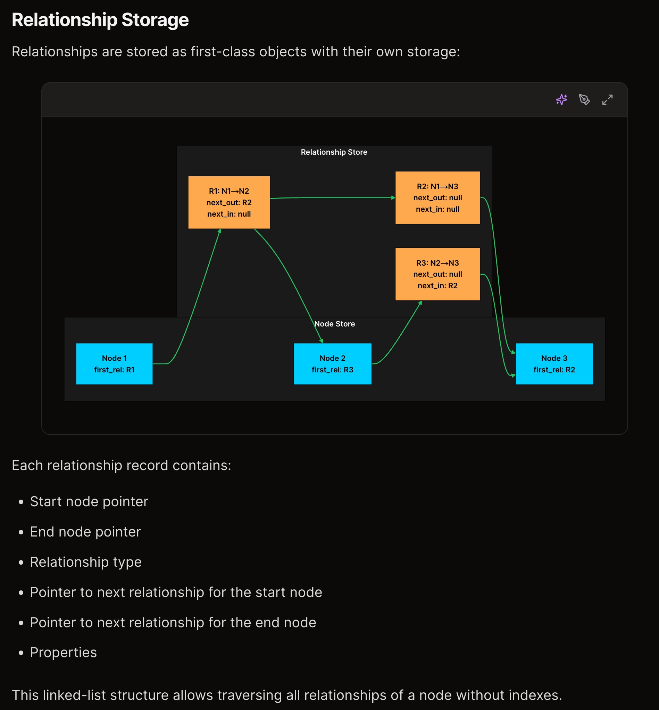
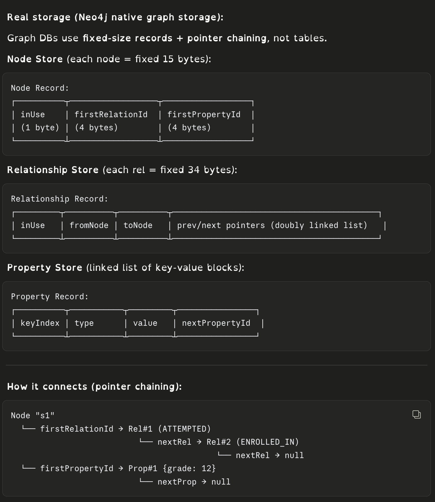
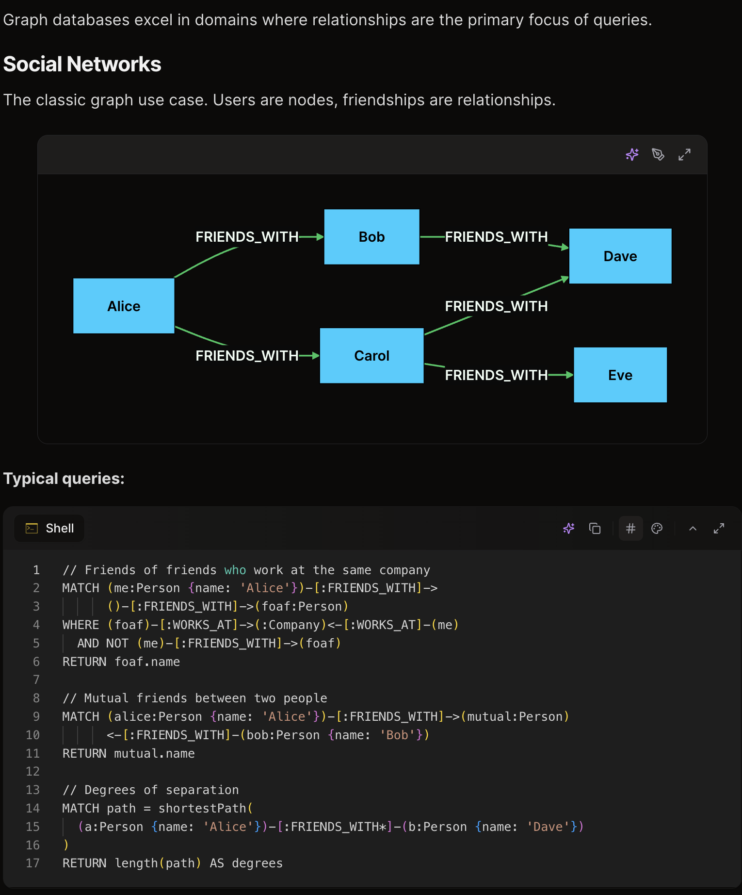
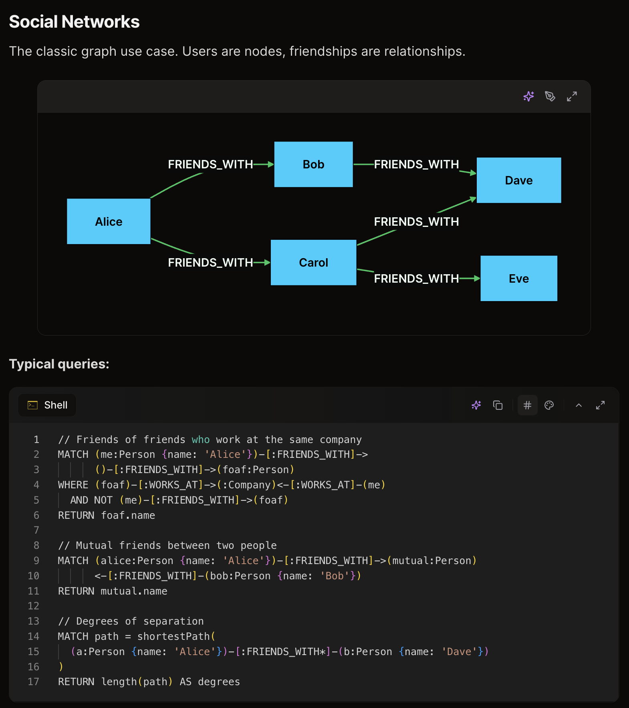

# Relational Databases

# Document Databases

Relational databases enforce a rigid schema — every row conforms to the same structure, hierarchical data must be flattened into multiple tables, and reads require joins to reassemble it.

Document databases trade that rigidity for flexibility. Data is stored as documents (typically JSON or BSON), grouped into collections (analogous to tables). Each document is self-contained — nested objects and arrays replace joins, and documents in the same collection can have different structures.

```js
// db.posts  — used throughout
{
  "_id": "post_12345",
  "title": "Understanding Document Databases",
  "author": { "id": "user_789", "name": "Alice Chen" },
  "tags": ["database", "mongodb"],
  "published_at": "2024-03-15T10:30:00Z",
  "comments": [
    { "user": "Bob Smith",  "text": "Great article!", "created_at": "2024-03-15T12:00:00Z" },
    { "user": "Carol Wu",   "text": "Very helpful.",  "created_at": "2024-03-15T14:30:00Z" }
  ],
  "stats": { "views": 1523, "likes": 47 }
}
```

## Embedding vs Referencing

**Embed** when data is accessed together, owned by one document, and doesn't grow unboundedly.

- e.g. `comments` inside a post — always read together, owned by the post
- Costs: duplication, update anomalies, 16 MB doc limit, unbounded array growth

**Reference** when data is shared or updated independently.

- e.g. `author.id` instead of the full user object — Alice's profile lives in `db.users`
- Costs: multiple queries, no native joins, dangling reference risk

## Query Capabilities

Instead of SQL, document databases expose a query API. Knowing the right method matters — it affects index usage, readability, and performance.

**`find`** — point lookups and simple filters. Hits indexes efficiently.

```js
db.posts.find({ _id: "post_12345" }, { title: 1, "author.name": 1, _id: 0 })
```

**Array operators** — query inside nested arrays without flattening (a key advantage over SQL).

```js
db.posts.find({ tags: "mongodb" })                         // tag match
db.posts.find({ "comments.user": "Bob Smith" })            // nested array field
```

**Aggregation pipeline** — use when you need grouping, joins, or multi-step transforms.

```js
db.posts.aggregate([
  { $match: { published_at: { $gte: ISODate("2024-01-01") } } },  // filter first — uses index
  { $unwind: "$comments" },                                        // flatten comments array
  { $group: { _id: "$_id", comment_count: { $sum: 1 }, total_likes: { $sum: "$stats.likes" } } },
  { $sort: { total_likes: -1 } },
  { $limit: 10 }
])

// Output (based on our post_12345 doc with 2 comments, likes: 47):
[
  { "_id": "post_12345", "comment_count": 2, "total_likes": 94 }
]
// ⚠ total_likes is 94 (47 × 2), not 47 — $unwind duplicated the doc once per comment,
//   so $sum: "$stats.likes" accumulates per unwound row, not per post.
//   To avoid this, $group before $unwind or use $first/$last for post-level fields.
```

Key stages: `$match` (filter early), `$group` (like GROUP BY), `$lookup` (join another collection), `$unwind` (flatten array), `$project` (reshape fields).

## Indexing

Without indexes, every query does a full collection scan. Indexes are sorted data structures that point to documents — trading write overhead for read speed.

**Index types**

| Type         | Use case                                                         |
| ------------ | ---------------------------------------------------------------- |
| Single field | Equality/range on one field —`{ email: 1 }`                   |
| Compound     | Multi-field queries —`{ status: 1, published_at: -1 }`        |
| Multikey     | Queries into arrays —`{ tags: 1 }` (auto-created per element) |
| Text         | Full-text search —`{ content: "text" }`                       |
| Geospatial   | Location queries —`{ location: "2dsphere" }`                  |
| Hashed       | Shard key distribution —`{ _id: "hashed" }`                   |

**Considerations**

- **Read/write trade-off** — every insert/update must also update all indexes. More indexes = slower writes.
- **Memory** — indexes should fit in RAM. Spilling to disk kills read performance.
- **Compound index field order** — equality conditions first, then sort fields, then range conditions.
- **Covered queries** — if the index contains every field the query needs, MongoDB skips reading the document entirely (fastest possible read).

# Full-Text Search Engines

`LIKE '%running shoes%'` scans every row, ignores word order, misses synonyms, and returns no relevance ranking — it doesn't scale.

Full-text search engines (Elasticsearch, OpenSearch) use **inverted indexes** that map words to documents. They apply linguistic analysis (`running` = `runs` = `ran`), score by relevance (BM25), and support faceted filtering, autocomplete, and fuzzy matching out of the box.

### How the Inverted Index Works

**Indexing** — when a document is inserted, text fields go through an analysis pipeline:

```
"Running shoes review"
  → tokenize  → ["Running", "shoes", "review"]
  → lowercase → ["running", "shoes", "review"]
  → stem      → ["run",     "shoe",  "review"]
```

These tokens are written into the inverted index (a term → posting list map):

```
"run"    → [post_1, post_4]
"shoe"   → [post_1, post_3]
"review" → [post_1, post_2]
```

The raw JSON is stored separately as `_source` (verbatim, for retrieval).

**Searching** — query `"running shoes"` goes through the same analysis → `["run", "shoe"]`:

1. Look up posting lists for each term — O(1), no scan
2. Intersect the lists → docs containing both → `post_1`
3. Score by BM25 (term frequency × rarity across all docs) → rank results
4. Fetch `_source` JSON for matching doc IDs → return to client

The index is built at **write time** so reads are just hash lookups + list intersections — not text scans.

### What Gets Indexed

Not all fields — only fields mapped as `text` get analyzed into an inverted index.

| Type                 | Index                               | Use case                |
| -------------------- | ----------------------------------- | ----------------------- |
| `text`             | inverted index (analyzed)           | full-text search        |
| `keyword`          | inverted index (exact, no analysis) | filter, sort, aggregate |
| `date`, `number` | BKD tree                            | range queries           |
| `geo_point`        | geo index                           | location queries        |

By default, Elasticsearch auto-detects types. A string field gets mapped as **both**:

```json
"title": {
  "type": "text",
  "fields": { "keyword": { "type": "keyword" } }
}
```

Fields you never search on should be explicitly set to `"index": false` — otherwise Elasticsearch builds and maintains an index you'll never use.

### Search Techniques

**Sample data — `products` index:**

```json
[
  { "_id": "p1", "name": "Running Shoes",     "brand": "Nike",   "price": 120, "rating": 4.5, "location": [72.8, 18.9] },
  { "_id": "p2", "name": "Athletic Footwear", "brand": "Adidas", "price": 90,  "rating": 4.2, "location": [72.9, 19.0] },
  { "_id": "p3", "name": "Running Cap",       "brand": "Nike",   "price": 30,  "rating": 3.8, "location": [73.0, 19.1] },
  { "_id": "p4", "name": "Leather Shoes",     "brand": "Clarks", "price": 150, "rating": 4.7, "location": [72.8, 18.8] }
]
```

**BM25** — keyword relevance, term frequency × rarity.

```json
{ "match": { "name": "running shoes" } }
// p1 (both terms) > p3 ("running") > p4 ("shoes") > p2 (0 overlap)
```

**Phrase match** — terms must be adjacent.

```json
{ "match_phrase": { "name": { "query": "running shoes", "slop": 0 } } }
// p1 ✓  p3 ✗ ("Running Cap" — "shoes" not adjacent)
```

**Fuzzy** — typo tolerance.

```json
{ "match": { "name": { "query": "runnin shoez", "fuzziness": "AUTO" } } }
// p1 ✓  p3 ✓  (AUTO allows 1-2 char edits)
```

**Semantic (vector)** — intent over keywords. BM25 returns 0 for `"athletic shoes"` — no overlap. Vector catches it.

```
query "athletic shoes" → embedding → cosine similarity
p2 (Athletic Footwear) → 0.91 ✓   ← BM25 misses this
p1 (Running Shoes)     → 0.94 ✓
p4 (Leather Shoes)     → 0.61 ✗
```

**Hybrid (BM25 + vector via RRF)** — best of both. Merges rankings without needing to normalize scores.

```
BM25 rank:   p1(1), p3(2), p4(3)
Vector rank: p1(1), p2(2), p4(3)
RRF:         p1(0.032) > p4(0.031) > p2(0.016) > p3(0.016)
// p2 surfaces even though BM25 missed it
```

**Faceted** — filter + aggregate alongside search.

```json
{
  "query": { "match": { "name": "shoes" } },
  "post_filter": { "term": { "brand": "Nike" } },
  "aggs": { "by_brand": { "terms": { "field": "brand.keyword" } } }
}
// Results: p1 only | Facets: Nike:2, Adidas:1, Clarks:1
```

**Geo** — filter by distance.

```json
{ "filter": { "geo_distance": { "distance": "5km", "location": [72.8, 18.9] } } }
// p1(0km) ✓  p4(1.1km) ✓  p2(1.8km) ✓  p3(3.4km) ✓
```

**Boosting** — business rules on top of relevance.

```json
"functions": [
  { "filter": { "term": { "brand": "Nike" } }, "weight": 3 },
  { "field_value_factor": { "field": "rating", "modifier": "log1p" } }
]
// p1 → BM25 × 3(Nike) × log(5.5) — surfaces above p4 despite lower rating
```

**Autocomplete** — prefix match from in-memory FST, fastest option.

```json
{ "suggest": { "prefix": "run", "completion": { "field": "name.suggest" } } }
// → ["Running Shoes", "Running Cap"]
```

**When to use what:**

```
simple keyword search        → BM25
exact filters/sorting        → keyword field
typos expected               → fuzzy
synonyms / intent            → semantic (vector)
both precision + recall      → hybrid (BM25 + vector + RRF)
filter by category/price     → faceted
location-based               → geo
promote featured/sponsored   → function_score
typeahead                    → completion suggester
```

### Reranking

BM25 retrieves fast but ranks by keyword overlap — not actual relevance. A reranker rescores the top-N candidates with a heavier model.

```
query → BM25 → top 100 docs → reranker → top 10 shown to user
```

**Bi-encoder** (retrieval) — embeds query and doc independently, ranks by vector similarity. Fast enough for full corpus via ANN index.

**Cross-encoder** (reranking) — takes `(query, doc)` as a pair, outputs a single relevance score. More accurate than bi-encoder but too slow for full corpus — only run on BM25 candidates.

**Common reranking signals:**

- Cross-encoder score (semantic similarity)
- Field boosts (`title` match > `content` match) "fields": ["title^3", "content^1"]   // title match = 3× score
- Business rules — featured, sponsored (`function_score` + `weight`)
- Engagement — `likes`, `views` via `field_value_factor` with `log1p`
- Recency — decay function on `published_at`
- CTR — click-through rate from past searches (LTR feature)

**Learning to Rank (LTR)** — ML model trained on engagement data (clicks, purchases) that combines all signals into one score. Used when heuristic boosts stop being enough.

# Graph Databases

A [graph](https://www.geeksforgeeks.org/graph-and-its-representations/) is a nonlinear data structure consisting of nodes and edges.

```
#### Representation ####

from collections import defaultdict, deque
# Unweighted graph
graph = defaultdict(list)
graph['A'].append('B')
graph['A'].append('C')

# Weighted graph
weighted_graph = defaultdict(list)
weighted_graph['A'].append(('B', 2))
weighted_graph['A'].append(('C', 4))


##### Traversal  ####

# BFS
def bfs_unweighted(graph, start):
    visited = set()
    queue = deque([start])
    visited.add(start)
  
    while queue:
        node = queue.popleft()
        print(node, end=" ")  # Process the node
      
        # Visit all unvisited neighbors
        for neighbor in graph[node]:
            if neighbor not in visited:
                queue.append(neighbor)
                visited.add(neighbor)
  
  
# DFS
def helper(u, graph, visited):
    visited.add(u)
    print(u)
    for v in graph[u]:
        if v not in visited:
          helper(v,dj, visited)

def dfs(graph):    
  visited = set()
  helper(0, graph visited);
```

## Property Graph

Property graph database structure its data with three core elements: **nodes** (entities), **relationships** (labeled connections), and **properties** (metadata).

- Data Storage

  
  

  ```python
  from dataclasses import dataclass, field
  from typing import Optional
  from enum import Enum

  # ── Property Store ──────────────────────────────────────────
  @dataclass
  class PropertyRecord:
      prop_id: str
      key: str
      value: int | str | float | bool
      next_prop_id: Optional[str] = None   # pointer to next property

  # ── Node Store ──────────────────────────────────────────────
  @dataclass
  class NodeRecord:
      node_id: str
      label: str                           # e.g. "Student", "Chapter"
      first_rel_id: Optional[str] = None   # pointer → first relationship
      first_prop_id: Optional[str] = None  # pointer → first property

  # ── Relationship Store ───────────────────────────────────────
  @dataclass
  class RelationshipRecord:
      rel_id: str
      rel_type: str                             # e.g. "ATTEMPTED", "CONTAINS"
      from_node_id: str
      to_node_id: str
      next_rel_from: Optional[str] = None       # next rel in from_node's chain
      next_rel_to: Optional[str] = None         # next rel in to_node's chain
      first_prop_id: Optional[str] = None       # pointer → properties


  # ── Property records ────────────────────────────────────────
  prop_A  = PropertyRecord("prop_A",  "grade",      12,   next_prop_id=None)
  prop_B  = PropertyRecord("prop_B",  "score",       8,   next_prop_id="prop_B2")
  prop_B2 = PropertyRecord("prop_B2", "time_spent", 120,  next_prop_id=None)
  prop_C  = PropertyRecord("prop_C",  "subject", "Physics", next_prop_id=None)

  # ── Node records ─────────────────────────────────────────────
  arjun   = NodeRecord("s1",   "Student", first_rel_id="rel_1", first_prop_id="prop_A")
  vectors = NodeRecord("ch_1", "Chapter", first_rel_id="rel_3", first_prop_id="prop_C")
  q101    = NodeRecord("q101", "Question",first_rel_id="rel_1", first_prop_id=None)

  # ── Relationship records ─────────────────────────────────────
  rel_1 = RelationshipRecord(
      rel_id="rel_1",
      rel_type="ATTEMPTED",
      from_node_id="s1",
      to_node_id="q101",
      next_rel_from="rel_2",   # Arjun's next rel → ENROLLED_IN
      next_rel_to=None,
      first_prop_id="prop_B"
  )

  rel_2 = RelationshipRecord(
      rel_id="rel_2",
      rel_type="ENROLLED_IN",
      from_node_id="s1",
      to_node_id="ch_1",
      next_rel_from=None,      # end of Arjun's chain
      next_rel_to="rel_3",     # Vectors' chain continues
      first_prop_id=None
  )

  rel_3 = RelationshipRecord(
      rel_id="rel_3",
      rel_type="CONTAINS",
      from_node_id="ch_1",
      to_node_id="q101",
      next_rel_from=None,
      next_rel_to=None,
      first_prop_id=None
  )

  # In-memory stores (in Neo4j these are disk files)
  node_store = {"s1": arjun, "ch_1": vectors, "q101": q101}
  rel_store  = {"rel_1": rel_1, "rel_2": rel_2, "rel_3": rel_3}
  prop_store = {"prop_A": prop_A, "prop_B": prop_B, "prop_B2": prop_B2, "prop_C": prop_C}

  def get_node_relationships(node_id: str) -> list[RelationshipRecord]:
      """Follow the linked list — O(1) per hop, no scan."""
      node = node_store[node_id]
      rels = []
      current_rel_id = node.first_rel_id
      while current_rel_id:
          rel = rel_store[current_rel_id]
          rels.append(rel)
          # follow the chain from this node's perspective
          current_rel_id = rel.next_rel_from if rel.from_node_id == node_id else rel.next_rel_to
      return rels

  def get_properties(first_prop_id: Optional[str]) -> dict:
      """Walk property linked list → return as dict."""
      props = {}
      current = first_prop_id
      while current:
          prop = prop_store[current]
          props[prop.key] = prop.value
          current = prop.next_prop_id
      return props

  # ── Usage ────────────────────────────────────────────────────
  rels = get_node_relationships("s1")
  for rel in rels:
      props = get_properties(rel.first_prop_id)
      print(f"Arjun --[{rel.rel_type}]--> {rel.to_node_id}  props={props}")

  # Output:
  # Arjun --[ATTEMPTED]--> q101       props={'score': 8, 'time_spent': 120}
  # Arjun --[ENROLLED_IN]--> ch_1     props={}
  ```
- UseCases
  
  

## **RDF (Resource Description Framework)**

```python
<Arjun> <attempted> <Question_101>
<Arjun> <hasScore>  "8"
```

- Everything is a **triple**: Subject → Predicate → Object
- No properties on relationships — relationships ARE nodes
- Every entity is a **URI** (globally unique identifier)
- Queried with **SPARQL**
- Designed for **semantic web / linked data** — sharing data across systems

 **Supernodes**

Supernodes are nodes with an unusually high number of relationships (e.g., a celebrity with millions of followers). They can cause performance problems:

```python
Normal user: 100-1000 relationships
Supernode: 1,000,000+ relationships
```

**Mitigation strategies:**

- **Limit traversal:** Use LIMIT to bound results
- **Filter early:** Apply filters before traversing from supernodes
- **Denormalize:** Store aggregated data to avoid traversing all relationships
- **Separate processing:** Handle supernodes differently in application logic
- **Indexing** - While relationships are traversed without indexes, finding starting nodes requires indexes:
  ```python
      # Index on 'name' property for fast lookup// Create index on Person.name for fast lookups
      CREATE INDEX FOR (p:Person) ON (p.name)

      // Composite index
      CREATE INDEX FOR (p:Person) ON (p.name, p.city)

      // Full-text index
      CREATE FULLTEXT INDEX person_names FOR (p:Person) ON EACH [p.name, p.bio]
  ```

 **Scaling graph databases**

It is hard to scale graph databases because graphs are connected — splitting them cuts relationships, forcing expensive network hops for cross-partition queries.

**Two approaches:**

**Vertical scaling** — just use a bigger machine. Neo4j handles billions of nodes on a single server. Simplest option, often good enough.

**Sharding** — split the graph across machines. Problem is there's no clean cut; relationships bleed across partitions. Three strategies exist: random (simple but messy), app-level by tenant/region (works when natural boundaries exist), or graph partitioning algorithms (minimize edge cuts but complex and imperfect).

**Sharding only works well when** the graph has natural isolated subgraphs — multi-tenant apps where each tenant is its own graph, or geographic splits where cross-region relationships are rare.

**Default advice:** scale vertically first. Only shard if you have a natural partition boundary — otherwise the cross-partition traversal cost kills the performance gains.

Bloom filters — a common first-check structure in front of database lookups — moved to [scalable-data-structures.md](../DSA/scalable-data-structures.md).
