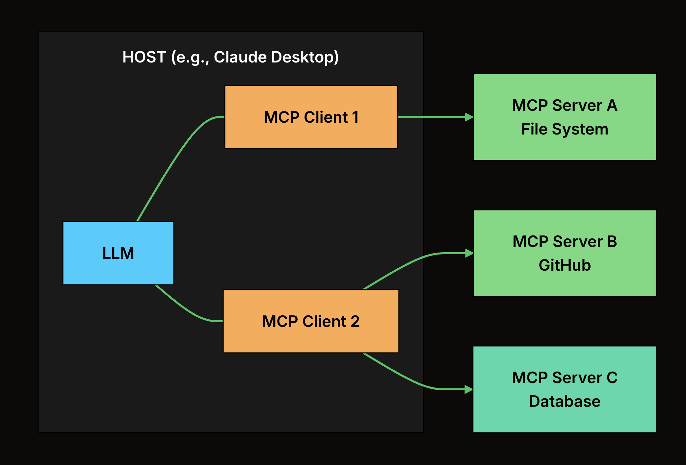
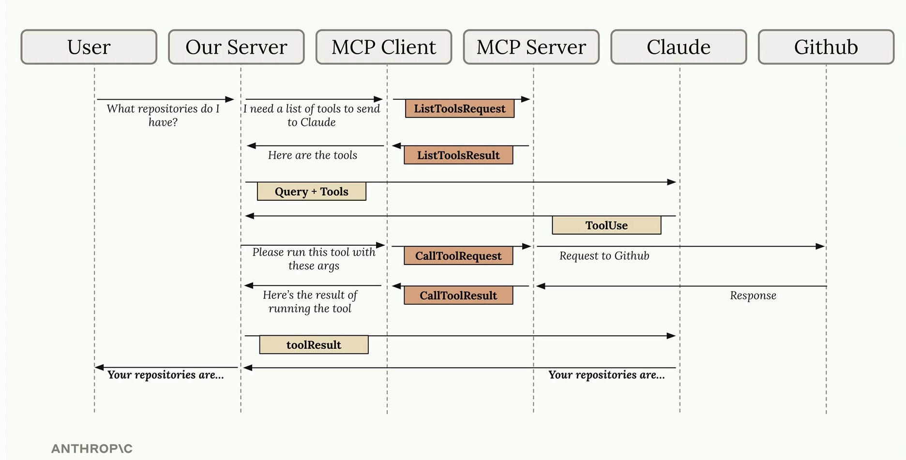
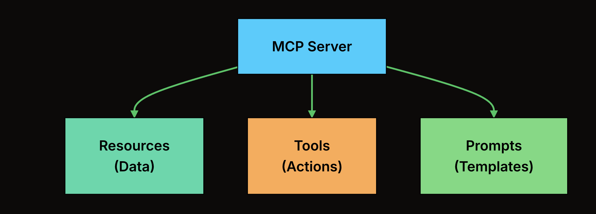
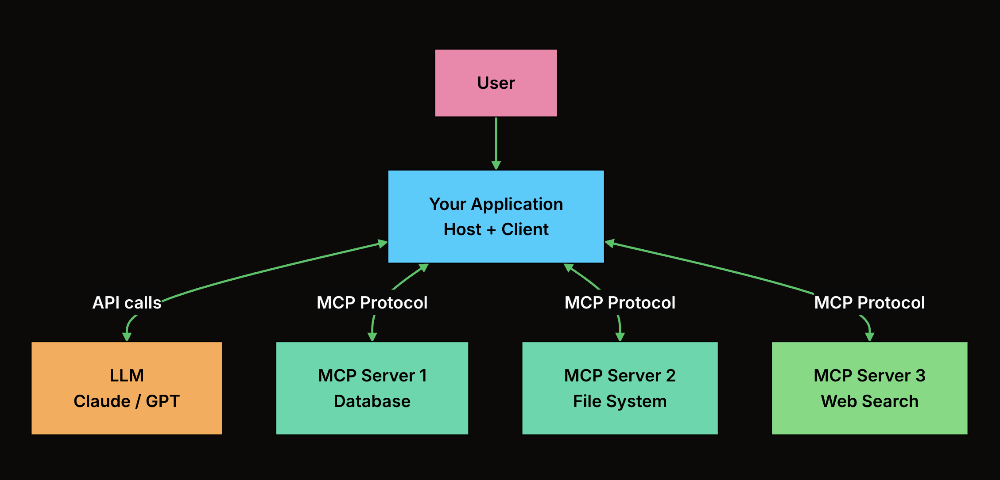
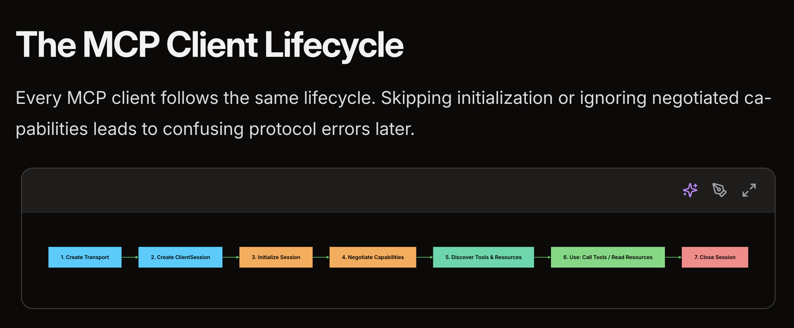

gi

```python
import streamlit as st
from langchain import hub
from langchain.text_splitter import CharacterTextSplitter
from langchain.embeddings import OpenAIEmbeddings
from langchain.vectorstores import Chroma
from langchain_core.runnables import RunnablePassthrough
from langchain_core.output_parsers import StrOutputParser
from langchain_openai import ChatOpenAI

# Specify the filename of your local image

image_filename = 'Educative.png'

# Use st.image to display the image

st.image(image_filename, use_column_width=True)

def format_docs(docs):
    return "\n\n".join(doc.page_content for doc in docs)

def generate_response(uploaded_file, openai_api_key, query_text):
    # Load document if file is uploaded
    if uploaded_file is not None:
        documents = [uploaded_file.read().decode()]
        # Split documents into chunks
        text_splitter = CharacterTextSplitter(chunk_size=500, chunk_overlap=100)
        texts = text_splitter.create_documents(documents)
        llm = ChatOpenAI(model="gpt-4o", openai_api_key=openai_api_key)
        # Select embeddings
        embeddings = OpenAIEmbeddings(model="text-embedding-3-small", openai_api_key=openai_api_key)
        # Create a vectorstore from documents
        database = Chroma.from_documents(texts, embeddings)
        # Create retriever interface
        retriever = database.as_retriever()
        prompt = hub.pull("rlm/rag-prompt")
        rag_chain = (
            {"context": retriever | format_docs, "question": RunnablePassthrough()}
            | prompt
            | llm
            | StrOutputParser()
)
        # Create QA chain
        response = rag_chain.invoke(query_text)
        return response

# File upload

uploaded_file = st.file_uploader('Upload an article', type='txt')

# Query text

query_text = st.text_input('Enter your question:', placeholder = 'Please provide a short summary.', disabled=not uploaded_file)

# Form input and query

result = None
with st.form('myform', clear_on_submit=False, border=False):
    openai_api_key = st.text_input('OpenAI API Key', type='password', disabled=not (uploaded_file and query_text))
    submitted = st.form_submit_button('Submit', disabled=not(uploaded_file and query_text))
    if submitted and openai_api_key.startswith('sk-'):
        with st.spinner('Calculating...'):
            response = generate_response(uploaded_file, openai_api_key, query_text)
            result = response
if result:
    st.info(result)
```


- **MCP (Model Context Protocol)**

  

  - **Purpose**: A **standard protocol** that defines **how an LLM can call external tools/APIs**
  - MCP changes the shape of that problem. A tool team can expose its capability once as an MCP server. An AI application can implement MCP client support once, then connect to compatible servers without writing a custom adapter for each one. Compatibility is not guaranteed; clients still differ in transport support, authentication support, approval UX, and feature coverage. But the protocol gives both sides a shared contract.
  - The **MCP host**The host is the AI application the user interacts with: a desktop assistant, an IDE extension, a CLI agent, or your own product. It owns the conversation, the model calls, the user interface, and the safety policy. The host is responsible for:

    - Managing user conversations and the overall application lifecycle
    - Enforcing security policies (which servers to connect to, which tools to allow)
    - Translating model tool requests into MCP calls
    - Routing those calls to the correct MCP client
    - Presenting results back to the user

    A single host usually manages multiple MCP clients. For example, a coding assistant might maintain separate clients for filesystem access, GitHub, package documentation, and a database schema server.
  - The **MCP client** resides within the host and is responsible for making requests to external tools and data sources. It acts on behalf of the AI model and maintains 1:1 connections with the server while residing inside the host.
    The client is the protocol handler inside the host. In the standard architecture, one client manages one connection to one MCP server. Its job is deliberately narrow:

  Establishing the connection to a server (via stdio or HTTP)
  Performing capability discovery (asking the server what tools, resources, and prompts it offers)
  Sending requests when the host decides to use a server capability
  Receiving responses and passing them back to the host
  The 1:1 relationship keeps failures and permissions easier to reason about. If one server crashes or becomes unresponsive, the host can degrade that connection without tearing down every other integration.

  - The **MCP server** exposes an external tool or data source (like a database, API, or local file system). It serves information and capabilities to the client in a standardized format that the AI can understand.
    Server
    The server is where the external capability is exposed. It may wrap a local command, a SaaS API, a database, a document store, an internal service, or a workflow. Servers expose capabilities through MCP primitives:

    A file system server that reads, writes, and searches local files
    A GitHub server that lists repos, reads code, and creates pull requests
    A PostgreSQL server that executes queries and exposes schema information
    A Slack server that sends messages and reads channels
    Servers can run locally as subprocesses of the host, or remotely behind an HTTP endpoint. Good servers tend to have a clear domain boundary: one server for GitHub, one for database metadata, one for incident-management operations. A server that exposes every internal system through one huge tool surface is harder to secure, test, and explain to a model.

  How a Request Flows
  When a user asks a question that requires external data, here is the full sequence:

  

  # **The Three Primitives**

  

  At the heart of the MCP, the following are three fundamental components that inform how an AI agent interacts with the outside world:


  - **Resources: Exposing Data**Resources represent data a client can read and provide as context. Think of them as documents with stable URIs. A filesystem server might expose files. A database server might expose schemas. An API documentation server might expose endpoint specs.

    Resources are identified by URIs, like file:///home/user/notes.txt or db://products/schema. Clients can list available resources, read their contents, and optionally subscribe to changes (for resources that update over time).

    The design intent is that resources are read-oriented and side-effect-free. Reading a resource should not modify business state. That makes resources safer to preload, cache, display in a picker, or inject into the model context under host control.

    ```python
    from mcp.server.fastmcp import FastMCP

    mcp = FastMCP("docs-server")

    @mcp.resource("docs://api/endpoints")
    def get_api_docs() -> str:
        """Return the current API endpoint documentation."""
        return load_api_documentation()

    @mcp.resource("docs://changelog/{version}")
    def get_changelog(version: str) -> str:
        """Return the changelog for a specific API version."""
        return load_changelog(version)
    ```
  - **Tools: Performing Actions**Tools are callable operations. They might search files, execute a query, send a message, create a pull request, or run a calculation. Each tool has a name, description, and input schema.

    Tools are model-visible and may have side effects. Writing a file, sending an email, or deleting a record should be modeled as a tool, not a resource. Hosts should show which tools are available and require confirmation for sensitive operations. The protocol recommends human control; the host enforces it.

    ```python
    @mcp.tool()
    def search_codebase(query: str, file_type: str = "") -> str:
        """Search the codebase for files matching a query.

        Args:
            query: Search term to look for in file contents.
            file_type: Optional file extension filter (e.g., '.py', '.js').
        """
        results = perform_search(query, file_type)
        return format_results(results)

    @mcp.tool()
    def create_github_issue(title: str, body: str, labels: list[str] = []) -> str:
        """Create a new issue in the GitHub repository.

        Args:
            title: Issue title.
            body: Issue description in markdown.
            labels: Optional list of labels to apply.
        """
        issue = github_client.create_issue(title=title, body=body, labels=labels)
        return f"Created issue #{issue.number}: {issue.html_url}"
    ```
  - **Prompts: Reusable Templates**
    Prompts are reusable prompt templates that a server offers to clients. A code review server might provide a "review this pull request" prompt. A database server might provide an "optimize this query" prompt with the right diagnostic sequence.

    Prompts are normally user-controlled. They are often exposed as slash commands, menu items, or workflow templates. They shape how the model approaches a task; they do not execute work by themselves.

    ```python
    @mcp.prompt()
    def code_review(language: str, code: str) -> str:
        """Guide the AI through a structured code review.

        Args:
            language: Programming language of the code.
            code: The code to review.
        """
        return f"""Review the following {language} code. Analyze it for:
    1. Correctness: Are there any bugs or logic errors?
    2. Performance: Are there any obvious inefficiencies?
    3. Readability: Is the code clear and well-structured?
    4. Security: Are there any security vulnerabilities?

    Code to review:
    {code}
    Provide specific, actionable feedback for each category."""
    ```

  MCP clients will use the **`*/list`** methods to discover available primitives.

  **Clients exposed primitives**:

  - **Sampling**: Allows servers to request language model completions from the client’s AI application. This is useful when servers’ authors want access to a language model, but want to stay model independent and not include a language model SDK in their MCP server. They can use the **`sampling/complete`** method to request a language model completion from the client’s AI application.
  - **Elicitation**: Allows servers to request additional information from users. This is useful when servers’ authors want to get more information from the user, or ask for confirmation of an action. They can use the **`elicitation/request`** method to request additional information from the user.
  - **Logging**: Enables servers to send log messages to clients for debugging and monitoring purposes.

  For more details about client primitives see [**client concepts**](https://modelcontextprotocol.io/docs/learn/client-concepts)

  ### **Layers**

  MCP consists of two layers:

  - **Data layer**: The data layer implements a [**JSON-RPC 2.0](https://www.jsonrpc.org/)**  based protocol for client-server communication that defines the message structure and semantics. Developers will likely find the data layer — in particular, the set of [**primitives](https://modelcontextprotocol.io/docs/learn/architecture#primitives)** — to be the most interesting part of MCP. It is the part of MCP that defines the ways developers can share context from MCP servers to MCP clients. It includes:

    1. **Lifecycle management**: MCP is a stateful protocol, The purpose of lifecycle management is to negotiate the capabilities that both client and server support. MCP begins with lifecycle management through a capability negotiation handshake. The client sends an **`initialize`** request to establish the connection and negotiate supported features.
    2. **Primitives**:  Tools, Resources, and Prompts
    3. **Notifications:** MCP supports real-time notifications between servers and clients. When tools are added, updated, or removed, the server sends JSON-RPC 2.0 notification messages (without expecting a response) to keep clients synchronized and up to date. This enables dynamic, responsive communication within MCP connections.

       ```python
       # Pseudo-code for AI application notification handling
       async def handle_tools_changed_notification(session):
           tools_response = await session.list_tools()
           app.update_available_tools(session, tools_response.tools)
           if app.conversation.is_active():
               app.conversation.notify_llm_of_new_capabilities()
       ```
  - **Transport layer**: Defines the communication mechanisms and channels that enable data exchange between clients and servers, including transport-specific connection establishment, message framing, and authentication between clients and servers.

    MCP supports two transport mechanisms:

    - **Stdio transport**: With stdio transport, the MCP server runs as a child process of the host application. The client spawns the server process and communicates with it by writing JSON-RPC messages to the server's standard input and reading responses from its standard output.
    - **Streamable HTTP transport**: Uses HTTP POST for client-to-server messages with optional SSE for streaming capabilities. This enables remote server communication and supports standard HTTP authentication methods including bearer tokens, API keys, and custom headers.

  Conceptually the data layer is the inner layer, while the transport layer is the outer layer.

  When you build an MCP server well, you can reuse it across these hosts. In practice, you still test against the clients your users care about. Some clients support only stdio, some support remote servers, some have different approval UX, and authenticated remote MCP is still an area where implementations vary.

  ### MCP vs Function Calling

  **Function Calling** allows an LLM to generate structured requests to invoke specific tools or functions defined by an application. However, the tools must be manually defined and managed by the developer.

  **MCP (Model Context Protocol)** is a standard protocol that enables applications to dynamically discover, describe, and access tools, resources, and prompts from external servers.

  **How they work together:**

  1. MCP discovers available tools.
  2. The tools are converted into the model's function-calling format.
  3. The LLM selects a tool using function calling.
  4. The request is executed through MCP.

  **What MCP adds beyond Function Calling:**

  * Dynamic tool discovery
  * Standardized integrations
  * Reusable tools across applications
  * Built-in versioning and capability negotiation
  * Separation of tool logic from application code

  **In short:** Function calling tells the model *how to use a tool*, while MCP defines *how tools are shared, discovered, and accessed*.

  ## MCP Client

  **Why build your own MCP client?**
  You build your own MCP client when you need custom behavior such as authorization, logging, tool filtering, workflow orchestration, retries, or integration into your own application.

  **Doesn't Claude Code already have an MCP client?**
  Yes, tools like Claude Code, Claude Desktop, and Cursor already include MCP clients, but they are general-purpose hosts and don't provide the custom business logic and control that a dedicated application may require.

  The Architecture: Where Your Client Fits
  Before writing code, get the boundary right. MCP has three roles: the host (your application), the client (the MCP protocol handler inside the host), and the server (the capability provider). When you build a custom MCP client in an application, you are usually building both the host and the client.

  Here is how everything connects when you wire MCP into an LLM application:
  


